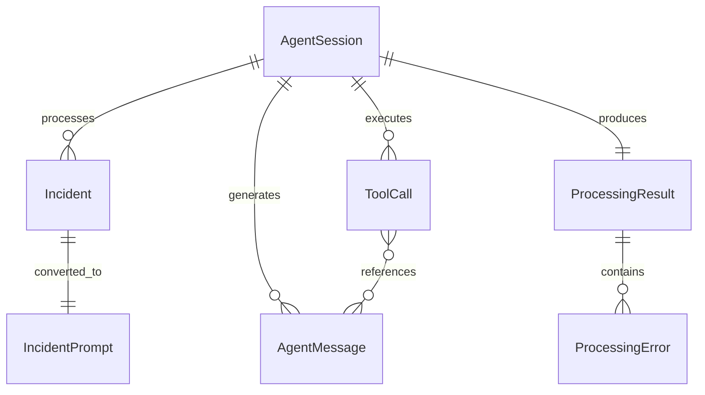

# Data Model: Agent Implementation

**Feature**: Agent Implementation
**Date**: 2025-12-23
**Purpose**: Define data structures and entity relationships for Goose Agent integration

---

## Core Entities

### Incident
**Source**: Already defined in `src/models/incident.rs`

Represents a code migration issue requiring agent attention.

```rust
pub struct Incident {
    pub id: String,                    // UUID identifier
    pub rule_id: String,              // Rule that triggered this incident
    pub file_path: String,            // File location
    pub line_number: u32,             // Line number in file
    pub severity: Severity,           // Error, Warning, Info
    pub description: String,          // Human-readable description
    pub message: String,              // Detailed message
    pub category: String,             // Classification category
    pub metadata: Metadata,           // Extensible key-value data
}

pub enum Severity {
    Error,
    Warning,
    Info,
}
```

**Relationships**:
- Input to Agent Sessions for processing
- Converted to prompt text for Goose agent
- Referenced in Processing Results for tracking

**Validation Rules**:
- `description` and `file_path` must be non-empty
- `line_number` must be > 0
- Valid file path required for incident processing

---

### Agent Session
**Source**: Enhanced from existing `src/models/session.rs`

Represents an active agent processing session with state tracking, streaming connections, and result management.

```rust
pub struct AgentSession {
    pub id: String,                           // Session UUID
    pub incident_ids: Vec<String>,           // Associated incidents
    pub workspace_path: PathBuf,             // Working directory
    pub status: SessionStatus,               // Current session state
    pub configuration: SessionConfiguration, // Provider and model config
    pub created_at: Timestamp,               // Creation time
    pub updated_at: Timestamp,               // Last update
    pub goose_session_id: Option<String>,    // Associated Goose session ID
    pub token_usage: TokenUsage,             // Accumulated token metrics
    pub stream_connection: Option<StreamConnection>, // Active streaming channel
}

pub enum SessionStatus {
    Created,        // Session initialized but not started
    Initializing,   // Goose Agent being created
    Ready,          // Agent ready for processing
    Processing,     // Agent actively working
    Completed,      // Processing finished successfully
    Failed,         // Processing failed with errors
    Terminated,     // Session manually terminated
}

pub struct SessionConfiguration {
    pub provider: Option<String>,      // LLM provider (openai, anthropic, etc.)
    pub model: Option<String>,        // Model name (gpt-4, claude-3, etc.)
    pub timeout: u32,                 // Session timeout in seconds
    pub max_turns: u32,               // Maximum conversation turns
    pub enable_tool_interception: bool, // File modification approval workflow
}

pub struct TokenUsage {
    pub input_tokens: u64,
    pub output_tokens: u64,
    pub total_tokens: u64,
}

pub struct StreamConnection {
    pub connection_id: String,
    pub established_at: Timestamp,
    pub last_message_at: Option<Timestamp>,
}
```

**State Transitions**:
```
Created → Initializing → Ready → Processing → (Completed | Failed)
                                     ↓
                                 Terminated (from any state)
```

**Relationships**:
- Contains multiple Incidents for batch processing
- Generates Agent Messages during processing
- Creates Tool Calls during execution
- Produces Processing Results as final status

---

### Agent Message
**Source**: Enhanced from existing `src/models/messages.rs`

Represents real-time communication from the agent including text responses, thinking updates, and status changes.

```rust
pub struct AgentMessage {
    pub id: String,                    // Message UUID
    pub session_id: String,           // Associated session
    pub timestamp: Timestamp,         // Creation time
    pub sequence_number: u64,         // Ordering within session
    pub content: MessageContent,      // Message payload
    pub source: MessageSource,        // Origin of message
}

pub enum MessageContent {
    Progress {
        percentage: u8,
        phase: String,
        description: String
    },
    AiResponse {
        text: String,
        partial: bool,
        confidence: Option<f32>
    },
    ToolCall {
        tool_call_id: String,
        tool_name: String,
        operation: ToolOperation,
        parameters: serde_json::Value,
        result: Option<ToolResult>
    },
    Thinking {
        text: String
    },
    UserInteraction {
        interaction_id: String,
        interaction_type: InteractionType,
        prompt: String,
        options: Option<Vec<String>>,
        timeout: Option<u32>
    },
    FileModification {
        proposal_id: String,
        file_path: String,
        change_type: ChangeType,
        original_content: Option<String>,
        proposed_content: Option<String>
    },
    Error {
        error_code: String,
        message: String,
        details: Option<String>,
        recoverable: bool
    },
    System {
        event: String,
        request_id: Option<String>,
        status: String,
        metadata: Option<serde_json::Value>
    },
}

pub enum MessageSource {
    GooseAgent,          // From Goose agent processing
    ToolExecution,       // From tool call execution
    SystemMonitoring,    // From session management
    UserInteraction,     // From user input/approval
}

pub enum ToolOperation {
    Start,     // Tool execution began
    Progress,  // Tool progress update
    Complete,  // Tool execution finished
    Error,     // Tool execution failed
}

pub enum InteractionType {
    Approval,     // Yes/No approval needed
    Choice,       // Select from options
    Input,        // Free text input required
}

pub enum ChangeType {
    Create,    // New file creation
    Modify,    // Existing file modification
    Delete,    // File deletion
    Rename,    // File rename/move
}
```

**Relationships**:
- Belongs to specific Agent Session
- May reference Tool Calls
- Ordered by sequence_number within session
- Streamed to clients via real-time connections

---

### Tool Call
**Source**: Based on research findings from Goose tool execution patterns

Represents agent requests to execute external tools with parameters, execution status, and results.

```rust
pub struct ToolCall {
    pub id: String,                    // Tool call UUID
    pub session_id: String,           // Associated session
    pub tool_name: String,            // Tool being executed
    pub parameters: serde_json::Value, // Tool parameters
    pub status: ToolCallStatus,        // Current execution status
    pub created_at: Timestamp,        // Call initiation time
    pub completed_at: Option<Timestamp>, // Completion time
    pub result: Option<ToolResult>,    // Execution result
    pub approval_required: bool,       // Whether approval workflow triggered
    pub approval_status: Option<ApprovalStatus>, // Approval state
    pub intercepted: bool,             // Whether call was intercepted for safety
}

pub enum ToolCallStatus {
    Pending,      // Tool call created, awaiting execution
    Approved,     // User approved tool execution
    Executing,    // Tool currently running
    Completed,    // Tool finished successfully
    Failed,       // Tool execution failed
    Cancelled,    // Tool execution cancelled
    Rejected,     // User rejected tool execution
}

pub struct ToolResult {
    pub success: bool,
    pub data: Option<serde_json::Value>,
    pub error: Option<String>,
    pub execution_time_ms: u64,
    pub output_size_bytes: Option<u64>,
}

pub enum ApprovalStatus {
    NotRequired,    // Tool doesn't require approval
    Pending,        // Awaiting user approval
    Approved,       // User approved execution
    Rejected,       // User rejected execution
    Timeout,        // Approval timeout exceeded
}
```

**Validation Rules**:
- Tool calls requiring approval must complete approval workflow
- File modification tools trigger approval workflow by default
- Tool results must include success status and execution time
- Failed tools must provide error information

**Relationships**:
- Created within Agent Sessions during processing
- Referenced in Agent Messages for status updates
- File modifications are applied to disk upon approval and execution

---

### Processing Result
**Source**: Based on feature requirements for end-to-end testing and validation

Represents the final outcome of agent processing including success status and any errors encountered. The actual "solution" is the changes made to files on disk via tool calls.

```rust
pub struct ProcessingResult {
    pub id: String,                    // Result UUID
    pub session_id: String,           // Associated session
    pub incident_ids: Vec<String>,    // Processed incidents
    pub status: ProcessingStatus,     // Overall result status
    pub created_at: Timestamp,        // Processing start time
    pub completed_at: Option<Timestamp>, // Processing end time
    pub errors: Vec<ProcessingError>, // Encountered errors
    pub metadata: ProcessingMetadata, // Execution metadata
    pub files_modified: Vec<String>,  // List of files that were changed
}

pub enum ProcessingStatus {
    InProgress,   // Processing ongoing
    Completed,    // Processing finished (may have succeeded or failed individual incidents)
    Failed,       // Processing failed entirely (agent error, timeout, etc.)
    Cancelled,    // Processing cancelled by user
}

pub struct ProcessingError {
    pub error_type: ErrorType,
    pub message: String,
    pub incident_id: Option<String>,
    pub tool_call_id: Option<String>,
    pub stack_trace: Option<String>,
    pub recoverable: bool,
}

pub enum ErrorType {
    IncidentProcessing,  // Error processing specific incident
    ToolExecution,       // Tool call execution failure
    AgentCommunication, // Communication with Goose agent failed
    TimeoutExpired,     // Processing timeout exceeded
    SystemError,        // System-level error
}

pub struct ProcessingMetadata {
    pub total_processing_time_ms: u64,
    pub token_usage: TokenUsage,
    pub tool_calls_count: u32,
    pub approval_requests_count: u32,
    pub files_changed_count: u32,
    pub goose_version: String,
    pub model_used: String,
    pub provider_used: String,
}
```

**Relationships**:
- Final output of Agent Session processing
- Aggregates status from Tool Calls (actual file changes are on disk)
- References original Incidents for tracking
- Contains comprehensive metadata for analysis and debugging

---

## Incident to Prompt Conversion

Since the agent works with natural language prompts, incidents need to be converted to text:

```rust
pub struct IncidentPrompt {
    pub incident_id: String,
    pub prompt_text: String,      // Natural language description
    pub context_files: Vec<String>, // Relevant file paths for context
    pub workspace_path: String,   // Working directory
}

impl IncidentPrompt {
    pub fn from_incident(incident: &Incident, workspace_path: &str) -> Self {
        let prompt_text = format!(
            "Please help fix this code migration issue:\n\n\
            File: {}\n\
            Line: {}\n\
            Issue: {} ({})\n\
            Description: {}\n\
            Message: {}\n\n\
            Please analyze the file and make the necessary changes to resolve this {} issue.",
            incident.file_path,
            incident.line_number,
            incident.category,
            incident.severity,
            incident.description,
            incident.message,
            incident.severity
        );

        Self {
            incident_id: incident.id.clone(),
            prompt_text,
            context_files: vec![incident.file_path.clone()],
            workspace_path: workspace_path.to_string(),
        }
    }
}
```

---

## Entity Relationships



## Data Validation Requirements

### Session Management
- Session IDs must be unique and non-reusable
- Session status transitions must follow defined state machine
- Token usage must be non-negative and monotonically increasing
- Workspace paths must be valid and accessible

### Message Streaming
- Messages must be ordered by sequence_number within session
- Message content must match declared MessageContent variant
- Tool call references must point to valid ToolCall entities
- File modification proposals must include valid file paths

### Tool Execution
- Tool parameters must match expected tool schema
- Approval workflow required for file modification tools
- Tool results must include execution timing information
- Failed tools must provide actionable error messages
- **File changes are applied to disk during tool execution, not stored separately**

### Processing Results
- Must reference valid incident IDs
- Processing status reflects overall session outcome
- File modification list tracks what was actually changed on disk
- Processing metadata must include comprehensive timing information

---

## Storage Considerations

Based on research findings, data will be:

### In-Memory (Session State)
- Active AgentSession objects during processing
- Real-time streaming AgentMessage queue
- Pending ToolCall approval workflows

### File-Based (Test Infrastructure)
- TestProvider recording/replay files (JSON)
- Sample incident fixtures for integration testing
- Test workspace snapshots

### File System (Actual Results)
- **Modified files on disk are the actual "solutions"**
- Changes applied via tool calls with approval workflow
- No separate solution storage required

### No Persistence Required
- Processing results are transient for this feature
- Session history not required for standalone verification
- Tool execution logs captured only during active sessions

This aligns with feature scope focusing on integration validation rather than production deployment.