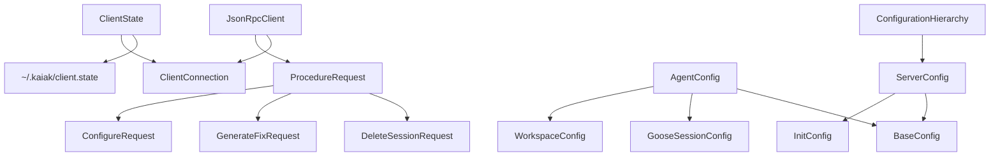

# Data Model: Kaiak Client Implementation

**Date**: 2025-12-27
**Feature**: 004-kaiak-client
**Status**: Phase 1 Design

## Overview

This document defines the data models and entities required for the Kaiak client implementation. The design prioritizes reusing existing structures while adding client-specific models for connection state and unified configuration management.

## Core Entities

### 1. ClientConnection (NEW)

Represents the persistent connection state between client and server.

```rust
use chrono::{DateTime, Utc};
use serde::{Deserialize, Serialize};

#[derive(Debug, Clone, Serialize, Deserialize)]
pub struct ClientConnection {
    /// Unix socket path to the server
    pub socket_path: String,

    /// Timestamp when connection was established
    pub connected_at: DateTime<Utc>,

    /// Last successful connection validation (for health checks)
    pub last_validated: Option<DateTime<Utc>>,

    /// Optional server version for compatibility checking
    pub server_version: Option<String>,
}
```

**Relationships**:
- Persisted in `~/.kaiak/client.state`
- Used by `ClientState` for connection management
- Validated by client before remote procedure calls

**Validation Rules**:
- `socket_path` must be valid Unix socket path
- `connected_at` cannot be in the future
- `last_validated` must be after `connected_at` if present

**State Transitions**:
```
None → Connected → Validated → Disconnected → None
```

### 2. ClientState (NEW)

Manages client connection lifecycle and state persistence.

```rust
use std::path::PathBuf;
use anyhow::Result;

pub struct ClientState {
    /// Current connection information
    pub connection: Option<ClientConnection>,

    /// Path to state file (default: ~/.kaiak/client.state)
    state_file: PathBuf,
}

impl ClientState {
    /// Load client state from file system
    pub fn load() -> Result<Self>;

    /// Save current state to file system
    pub fn save(&self) -> Result<()>;

    /// Establish new connection
    pub fn connect(&mut self, socket_path: String, server_version: Option<String>) -> Result<()>;

    /// Remove connection state
    pub fn disconnect(&mut self) -> Result<()>;

    /// Validate current connection is still active
    pub async fn validate_connection(&mut self) -> Result<bool>;

    /// Get current connection or error if not connected
    pub fn require_connection(&self) -> Result<&ClientConnection>;
}
```

### 3. ServerConfig (UNIFIED)

Replaces existing `ServerSettings` with unified configuration structure as specified in user requirements.

```rust
use serde::{Deserialize, Serialize};
use validator::Validate;

#[derive(Debug, Clone, Serialize, Deserialize, Validate)]
pub struct ServerConfig {
    /// Immutable configuration set at server launch
    #[validate(nested)]
    pub init_config: InitConfig,

    /// Mutable configuration that can be changed via configure() procedure
    #[validate(nested)]
    pub base_config: BaseConfig,
}

#[derive(Debug, Clone, Serialize, Deserialize, Validate)]
pub struct InitConfig {
    /// Transport method: "stdio" or "socket"
    #[validate(custom(function = "validate_transport_type"))]
    pub transport: String,

    /// Unix socket path (required when transport = "socket")
    pub socket_path: Option<String>,

    /// Logging level: trace, debug, info, warn, error
    #[validate(custom(function = "validate_log_level"))]
    pub log_level: String,

    /// Maximum concurrent agent sessions
    #[validate(range(min = 1, max = 100))]
    pub max_concurrent_sessions: u32,
}

#[derive(Debug, Clone, Serialize, Deserialize, Validate)]
pub struct BaseConfig {
    /// Goose model configuration (reusing existing GooseModelConfig)
    pub model: GooseModelConfig,

    /// Tool configuration (reusing existing ToolConfig)
    #[validate(nested)]
    pub tools: ToolConfig,

    /// Permission configuration (reusing existing PermissionConfig)
    #[validate(nested)]
    pub permissions: PermissionConfig,
}
```

**Relationships**:
- Loaded from `~/.kaiak/server.conf` or CLI arguments
- Used by server for initialization and runtime configuration
- `BaseConfig` can be updated via `configure()` JSON-RPC method

### 4. AgentConfig (UNIFIED)

Replaces existing `AgentConfiguration` with new structure that includes session-specific overrides.

```rust
#[derive(Debug, Clone, Serialize, Deserialize, Validate)]
pub struct AgentConfig {
    /// Workspace configuration (reusing existing WorkspaceConfig)
    #[validate(nested)]
    pub workspace: WorkspaceConfig,

    /// Goose session configuration (reusing GooseSessionConfig)
    pub session: GooseSessionConfig,

    /// Configuration that completely overrides server's base_config
    #[validate(nested)]
    pub override_base_config: BaseConfig,
}
```

**Usage Pattern**:
- Sent in `GenerateFixRequest`
- If session_id doesn't exist: create new session with this AgentConfig
- If session_id exists: ignore AgentConfig and use existing session

### 5. ConfigurationHierarchy (NEW)

Manages configuration precedence and merging as specified in requirements.

```rust
#[derive(Debug, Clone)]
pub struct ConfigurationHierarchy {
    /// Final resolved configuration
    pub resolved: ServerConfig,

    /// Sources used in resolution (for debugging)
    pub sources: Vec<ConfigSource>,
}

#[derive(Debug, Clone)]
pub struct ConfigSource {
    pub name: String,        // e.g., "CLI arguments", "~/.kaiak/server.conf"
    pub priority: u8,        // Higher number = higher priority
    pub fields_provided: Vec<String>,  // Which fields this source provided
}

impl ConfigurationHierarchy {
    /// Load configuration with precedence: CLI > user config > default config > hardcoded
    pub fn load_with_precedence(
        cli_overrides: Option<&ServerConfig>,
        user_config_path: Option<PathBuf>,
        default_config_path: Option<PathBuf>,
    ) -> Result<Self>;

    /// Apply environment variable overrides
    pub fn apply_env_overrides(&mut self) -> Result<()>;

    /// Validate final configuration
    pub fn validate(&self) -> Result<()>;
}
```

### 6. ProcedureRequest (ENHANCED)

Enhanced request wrapper for client-side JSON-RPC calls.

```rust
use serde_json::Value;

#[derive(Debug, Clone, Serialize, Deserialize)]
pub struct ProcedureRequest {
    /// JSON-RPC method name
    pub method: String,

    /// Request parameters as JSON value
    pub params: Value,

    /// Optional request timeout in seconds
    pub timeout: Option<u64>,

    /// Client connection info (for debugging)
    pub client_info: Option<ClientInfo>,
}

#[derive(Debug, Clone, Serialize, Deserialize)]
pub struct ClientInfo {
    pub version: String,
    pub socket_path: String,
    pub request_id: String,
}
```

**Relationships**:
- Used by `JsonRpcClient` for all server communication
- Maps to existing handler request types (ConfigureRequest, GenerateFixRequest, DeleteSessionRequest)
- Includes client metadata for troubleshooting

## Reused Entities

The following existing entities are reused without modification:

### From models/configuration.rs:
- `WorkspaceConfig` - workspace paths and patterns
- `ToolConfig` - tool and extension settings
- `PermissionConfig` - permission policies
- `GooseModelConfig` - model provider configuration
- `GooseSessionConfig` - session configuration from Goose

### From models/errors.rs:
- `KaiakError` (with one new variant: `ClientConnection`)

### From server/jsonrpc.rs:
- `ConfigureRequest` / `ConfigureResponse`
- `GenerateFixRequest` / `GenerateFixResponse`
- `DeleteSessionRequest` / `DeleteSessionResponse`
- Error codes and method constants

### From models/incidents.rs:
- `MigrationIncident` - incident data structure
- `IncidentSeverity` - severity enumeration

## Entity Relationships



## Validation Rules

### ClientConnection
```rust
fn validate_client_connection(connection: &ClientConnection) -> Result<(), validator::ValidationError> {
    // Socket path must exist or be creatable
    if !connection.socket_path.starts_with('/') {
        return Err(validator::ValidationError::new("Socket path must be absolute"));
    }

    // connected_at cannot be in future
    if connection.connected_at > Utc::now() {
        return Err(validator::ValidationError::new("Connection time cannot be in future"));
    }

    // last_validated must be after connected_at
    if let Some(validated) = connection.last_validated {
        if validated < connection.connected_at {
            return Err(validator::ValidationError::new("Validation time must be after connection time"));
        }
    }

    Ok(())
}
```

### InitConfig
```rust
fn validate_transport_type(transport: &str) -> Result<(), validator::ValidationError> {
    match transport {
        "stdio" | "socket" => Ok(()),
        _ => Err(validator::ValidationError::new("Transport must be 'stdio' or 'socket'")),
    }
}

fn validate_log_level(level: &str) -> Result<(), validator::ValidationError> {
    match level {
        "trace" | "debug" | "info" | "warn" | "error" => Ok(()),
        _ => Err(validator::ValidationError::new("Invalid log level")),
    }
}
```

## File System Integration

### State Persistence
- `~/.kaiak/client.state` - Client connection state (JSON format)
- `~/.kaiak/server.conf` - Server configuration (TOML format)
- `/tmp/kaiak-{pid}.sock` - Default socket path pattern

### Directory Structure
```
~/.kaiak/
├── client.state     # ClientConnection JSON
├── server.conf      # ServerConfig TOML
└── logs/           # Optional log directory
    ├── server.log
    └── client.log
```

## Error Handling Strategy

### New Error Types
```rust
#[derive(thiserror::Error, Debug)]
pub enum ClientError {
    #[error("No connection established. Run 'kaiak connect --socket <path>' first.")]
    NotConnected,

    #[error("Connection failed: {message}")]
    ConnectionFailed { message: String, socket_path: String },

    #[error("Server response timeout after {timeout}s")]
    Timeout { timeout: u64 },

    #[error("State file error: {source}")]
    StatePersistence { source: std::io::Error },

    #[error("Configuration validation failed: {details}")]
    ConfigValidation { details: String },
}
```

### User-Friendly Error Messages
```rust
impl ClientError {
    pub fn user_message(&self) -> String {
        match self {
            ClientError::NotConnected => {
                "No server connection found.\nRun 'kaiak connect --socket /path/to/socket' to connect.".to_string()
            }
            ClientError::ConnectionFailed { message, socket_path } => {
                format!(
                    "Failed to connect to server at '{}'.\nError: {}\n\nTroubleshooting:\n• Verify server is running: kaiak serve --socket {}\n• Check socket permissions\n• Ensure path exists",
                    socket_path, message, socket_path
                )
            }
            ClientError::Timeout { timeout } => {
                format!("Server did not respond within {}s. Server may be overloaded or unresponsive.", timeout)
            }
            // ... other user-friendly messages
        }
    }
}
```

## Implementation Notes

### Configuration Migration
To maintain backward compatibility during the transition:

1. Support loading old `ServerSettings` format
2. Automatically migrate to new `ServerConfig` structure
3. Emit deprecation warnings for old config format
4. Provide `kaiak config migrate` command

### Performance Considerations
- `ClientState` caching to avoid repeated file I/O
- Connection validation with exponential backoff
- Configuration validation only on load, not on every use
- Lazy loading of configuration hierarchy

### Testing Strategy
- Unit tests for each entity validation
- Integration tests for state persistence
- Property-based testing for configuration merging
- End-to-end tests for client-server communication

---

**Data Model Complete** - Ready for contract generation and implementation